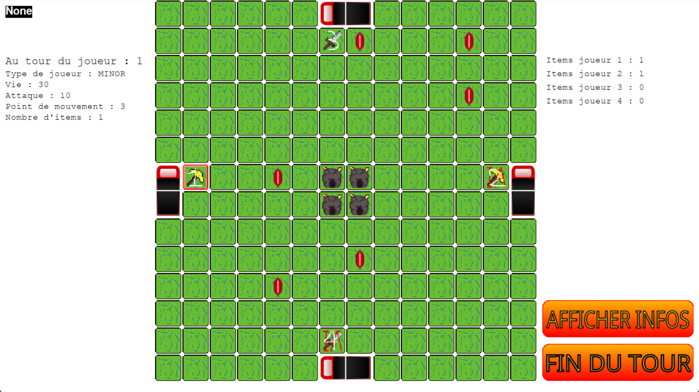

# Cubiverse

> Projet de 2e année de BUT en alternance

Bienvenue dans le **Cubiverse**, dans ce jeu de plateau, l'objectif est de réunir 4 pierres précieuses à la mine sacré.

Pour y arriver, divers moyens existent, vous pouvez en obtenir de 2 façons différentes

- Affronter un adversaire et lui voler une partie de ses ressources
- Aller les récupérer sur la carte

Une fois vos ressources obtenues, le but sera de déposer vos pierres précieuses au centre de la carte pour remporter la partie

Dans le jeu, il existe 2 type de classes, vous pouvez être:

- **Mineur** : vous commencez d'avance avec une pierre précieuse
- **Combattant** : vous infligez plus de dégats face à vos adversaires

Lors d'un combat, le gagnant inflige des dégâts à son adversaire et fais tomber une des pierres précieuse de son adversaire.
Si votre vie arrive à 0, vous revenez à votre point de départ (votre lit) et toutes vos pierres précieuses seront dispersés sur la carte.

## Jeu


Lors du démarrage du jeu, vous pouvez choisir votre classe, mineur ou combattant, une fois choisis, vous commencez le jeu.

Pour rappel:

- Le mineur commence la partie avec une pierre précieuse
- Le combattant inflige plus de dégâts

Vous avez alors 2 choix, ou vous combattez votre adversaire, ou vous vous déplacez à la recherche des pierres précieuses
Une fois toutes les pierres collectées, rendez-vous au centre de la carte

## Installation

Pour lancer le programme, vous devez avoir python installé sur votre machine, le package "pygame" est aussi à installer.

Si vous ne savez pas comment obtenir "pygame", effectuez la commande suivante dans un terminal

```bash
pip install pygame
```

Pour lancer le jeu, il suffit d'effectuer la commande suivante dans un terminal, à la racine du projet

```bash
python Main.py
```

## Fonctionnalités

Il existe plusieurs menu dans le jeu:

- Un menu d'accueil
- Un lobby, où l'on peut visualiser la classe de chaque joueur connecté
- Un menu de sélection de type de joueur
- Une fenêtre de jeu
- Un menu de fin de jeu

Au sein du jeu, il est possible de choisir parmis 4 types de classes:

- **Combattant** / **Combattant IA**
- **Mineur** / **Mineur IA**

Les IA utilisent l'algorithme de _Diskjstra_ pour fonctionner, ils suivent également le fonctionnement suivant pour se comporter face aux autres joueurs


### 🔧 En cours de développement

- La mise en réseau
- L'ajout des règles du jeu dans un nouveau menu du jeu

## Petit +

Si le souhaitez, il est possible de consulter la documentation technique de ce jeu, pour cela, rendez vous sur le fichier index.html dans le dossier doc

## Auteurs

- [@Happy4Game](https://github.com/Happy4Game/)
- [@Axadyc](https://github.com/Axadyc)
- [@matbysting](https://github.com/matbysting)
