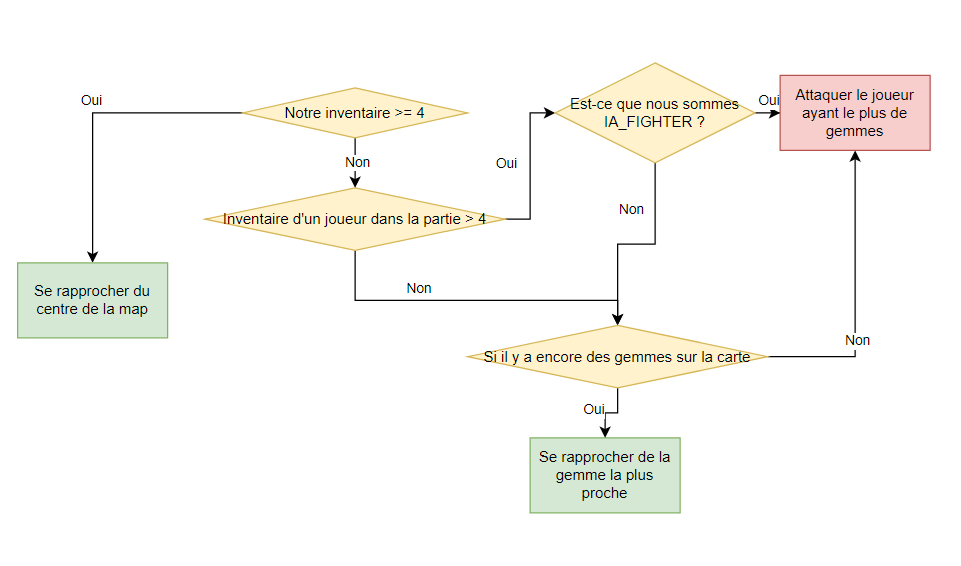

# Fonctionnalités

Il existe plusieurs menu dans le jeu:

- Un menu d'accueil
- Un lobby, où l'on peut visualiser la classe de chaque joueur connecté
- Un menu de sélection de type de joueur
- Une fenêtre de jeu
- Un menu de fin de jeu

Au sein du jeu, il est possible de choisir parmis 4 types de classes:

- **Combattant** / **Combattant IA**
- **Mineur** / **Mineur IA**

Les IA utilisent l'algorithme de _Diskjstra_ pour fonctionner, ils suivent également le fonctionnement suivant pour se comporter face aux autres joueurs
