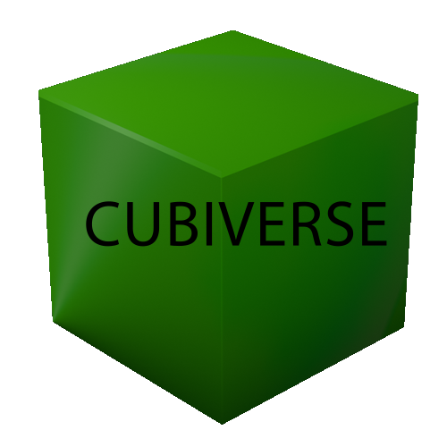

# Cubiverse

> Projet de 2e année de BUT en alternance

Bienvenue dans le **Cubiverse**, dans ce jeu de plateau, l'objectif est de réunir 4 pierres précieuses à la mine sacré.

Pour y arriver, divers moyens existent, vous pouvez en obtenir de 2 façons différentes

- Affronter un adversaire et lui voler une partie de ses ressources
- Aller les récupérer sur la carte

Une fois vos ressources obtenues, le but sera de déposer vos pierres précieuses au centre de la carte pour remporter la partie

Dans le jeu, il existe 2 type de classes, vous pouvez être:

- **Mineur** : vous commencez d'avance avec une pierre précieuse
- **Combattant** : vous infligez plus de dégats face à vos adversaires

Lors d'un combat, le gagnant inflige des dégâts à son adversaire et fais tomber une des pierres précieuse de son adversaire.
Si votre vie arrive à 0, vous revenez à votre point de départ (votre lit) et toutes vos pierres précieuses seront dispersés sur la carte.
