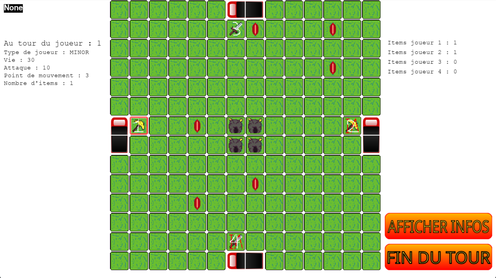

# Jeu

Lors du démarrage du jeu, vous pouvez choisir votre classe, mineur ou combattant, une fois choisis, vous commencez le jeu.

Pour rappel:

- Le mineur commence la partie avec une pierre précieuse
- Le combattant inflige plus de dégâts

Vous avez alors 2 choix, ou vous combattez votre adversaire, ou vous vous déplacez à la recherche des pierres précieuses
Une fois toutes les pierres collectées, rendez-vous au centre de la carte